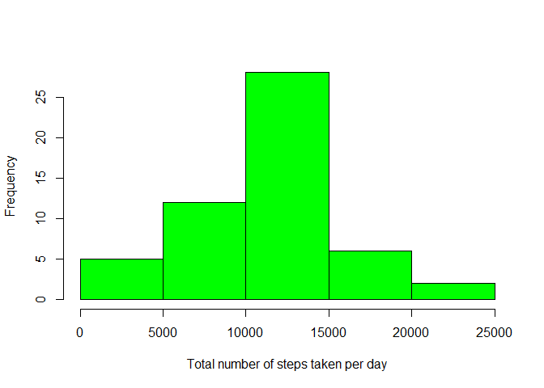
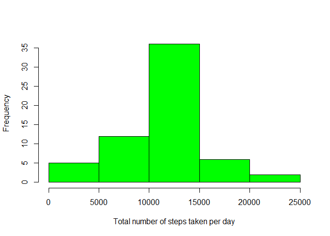
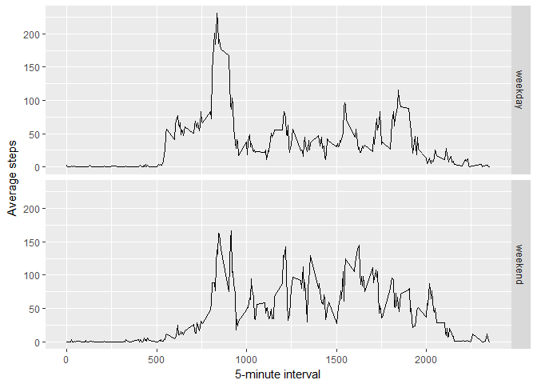

# Reproducible Research: Peer Assessment 1


## Loading and preprocessing the data


```r
unzip("activity.zip")
data <- read.csv("activity.csv")
```


## What is mean total number of steps taken per day?
A histogram of the total number of steps taken each day is shown below:

```r
library(dplyr)
```

```
## Warning: package 'dplyr' was built under R version 3.4.1
```

```
## 
## Attaching package: 'dplyr'
```

```
## The following objects are masked from 'package:stats':
## 
##     filter, lag
```

```
## The following objects are masked from 'package:base':
## 
##     intersect, setdiff, setequal, union
```

```r
data <- group_by(data, date)
sum <- summarise(data, total = sum(steps))
hist(sum$total,
     col = "green",
     xlab = "Total number of steps taken per day",
     main = "")
```

<!-- -->

```r
mean <- mean(sum$total, na.rm = TRUE)
median <- median(sum$total, na.rm = TRUE)
```
The mean of the total number of steps taken per day is 1.0766189\times 10^{4};
The median of the total number of steps taken per day is 10765.

## What is the average daily activity pattern?
The average daily activity pattern is shown below:

```r
data <- group_by(data, interval)
daily <- summarise(data,mean = mean(steps, na.rm = TRUE))
plot(daily$interval,
     daily$mean,
     type = "l",
     xlab = "5-minute interval",
     ylab = "Average steps")
```

<!-- -->

```r
max <- daily$interval[which.max(daily$mean)]
```
The 5-minute interval "835" contains the maximum number of steps.

## Imputing missing values


```r
na <- sum(is.na(data$steps))
```
The total number of missing values in the dataset is 2304.

To fill in all of the missing values in the dataset, here we use the mean for 
that 5-minute interval. And the updated estimates are shown below:

```r
data <- group_by(data, interval)
daily <- summarise(data,mean = mean(steps, na.rm = TRUE))
mdata <- merge(data, daily, all = TRUE)
i <- is.na(mdata$steps)
mdata$steps[i] <- mdata$mean[i]
mdata <- select(mdata,steps,date,interval)

mdata <- group_by(mdata, date)
sum2 <- summarise(mdata, total = sum(steps))
hist(sum2$total,
     col = "green",
     xlab = "Total number of steps taken per day",
     main = "")
```

<!-- -->

```r
mean2 <- mean(sum2$total, na.rm = TRUE)
median2 <- median(sum2$total, na.rm = TRUE)
```
The mean of the total number of steps taken per day is 1.0766189\times 10^{4}, this is the
same as the estimate in part 1;
The median of the total number of steps taken per day is 1.0766189\times 10^{4}, this is
different from the estimate in part 1 (10765).
Imputing missing data changed the median of the total daily number of steps,
without changing the mean.

## Are there differences in activity patterns between weekdays and weekends?
Activity patterns in weekdays and weekends are shown below:

```r
mdata$date <- as.character(mdata$date)
mdata$date <- as.Date(mdata$date)
## a function to determine whether it is a weekday or weekend (in Chinese system 
## language)
is.weekday <- function(x) {
        y <- weekdays(x)
        if(length(grep("六|日", y)) == 0) {z<- "weekday"} else {z<- "weekend"}
        z
}
mdata <- mutate(mdata, is.weekday = is.weekday(date))
```

```
## Warning: package 'bindrcpp' was built under R version 3.4.1
```

```r
mdata$is.weekday <- as.factor(mdata$is.weekday)
mdata <- group_by(mdata, is.weekday, interval)
sdata <- summarise(mdata, mean = mean(steps))
library(ggplot2)
qplot(interval, mean, data = sdata,
      facets=is.weekday~.,
      geom="line")+
        labs(x="5-minute interval", y="Average steps")
```

<!-- -->

As the plot shows, there are differences in activity patterns between weekdays 
and weekends: in the morning of weekdays there is a more obvious peek of steps 
when compared with the weekends, then in the noon of weekdays the average steps 
are lower than those of weekends.

